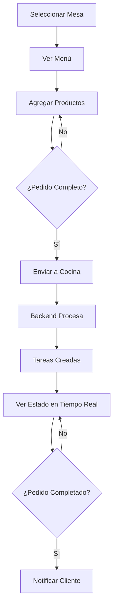

# 🍽️ Vista de Mesero - FoodTech Frontend

## 📐 Arquitectura Implementada

### Estructura del Proyecto

```
src/
├── models/              # Tipos y contratos de datos
│   ├── Product.ts       # Tipos de productos (DRINK, HOT_DISH, COLD_DISH)
│   ├── Order.ts         # Tipos de pedidos y requests/responses
│   ├── Task.ts          # Tipos de tareas de cocina
│   └── Table.ts         # Tipos de mesas
│
├── services/            # Comunicación con backend
│   ├── apiClient.ts     # Cliente HTTP simple
│   ├── orderService.ts  # Servicio de pedidos
│   └── taskService.ts   # Servicio de tareas
│
├── hooks/               # Lógica reutilizable
│   ├── useTables.ts     # Gestión de mesas
│   ├── useOrder.ts      # Gestión del pedido actual
│   └── useKitchenTasks.ts # Polling de estado de cocina
│
├── components/waiter/   # Componentes presentacionales
│   ├── TableCard.tsx       # Tarjeta individual de mesa
│   ├── TableSelector.tsx   # Panel lateral de mesas
│   ├── ProductCard.tsx     # Tarjeta de producto
│   ├── ProductGrid.tsx     # Grid de productos
│   ├── CategoryFilter.tsx  # Filtro de categorías
│   ├── OrderSummary.tsx    # Resumen del pedido
│   └── KitchenStatus.tsx   # Estado de cocina en tiempo real
│
├── views/               # Orquestación
│   └── WaiterView.tsx   # Vista principal del mesero
│
└── helpers/             # Datos auxiliares
    └── menuData.ts      # Menú de productos (mock)
```

---

## 🎨 Principios de Diseño Aplicados

### 1. Separación de Responsabilidades

**Models:** Contratos de datos puros (interfaces, enums)
- ✅ Sin lógica de negocio
- ✅ Alineados con endpoints del backend
- ✅ TypeScript estricto

**Services:** Comunicación con backend
- ✅ Encapsulan fetch API
- ✅ Tipado fuerte en requests/responses
- ✅ Manejo de errores básico

**Hooks:** Lógica de negocio reutilizable
- ✅ Estado local encapsulado
- ✅ Side effects controlados (useEffect)
- ✅ API simple y clara

**Components:** Presentación pura
- ✅ Sin lógica de negocio
- ✅ Props bien tipadas
- ✅ Componentes < 150 líneas
- ✅ Responsabilidad única

**Views:** Orquestación
- ✅ Conecta hooks y componentes
- ✅ Maneja flujos de usuario
- ✅ Coordinación de estado

---

## 🔌 Integración con Backend

### Endpoints Utilizados

```typescript
// Crear pedido (HU-001)
POST /api/orders
Body: {
  tableNumber: string,
  products: [{ name: string, type: ProductType }]
}

// Obtener estado de pedido
GET /api/orders/{orderId}/status

// Obtener tareas por estación (HU-002)
GET /api/tasks/station/{station}
```

### Configuración

Variables de entorno (`.env`):
```bash
VITE_API_BASE_URL=http://localhost:8080
```

---

## 🎯 Funcionalidades Implementadas

### 1. Gestión de Mesas
- Visualización de 8 mesas (A1-A4, B1-B4)
- Selección de mesa activa
- Estados: DISPONIBLE, OCUPADA
- Actualización de estado al enviar pedido

### 2. Gestión de Pedidos
- Agregar productos al pedido (con cantidad)
- Remover productos
- Cálculo automático de total
- Validación antes de enviar
- Limpiar pedido después de enviar

### 3. Menú de Productos
- Filtrado por categorías (Todos, Bebidas, Platos Fuertes, Ensaladas)
- 12 productos disponibles (4 por categoría)
- Indicador visual de productos en el pedido
- Precios y descripciones

### 4. Estado de Cocina
- Polling automático cada 5 segundos
- Visualización de todas las tareas
- Estados: PENDING, IN_PREPARATION, COMPLETED
- Refresh manual
- Agrupación por estación (BAR, HOT_KITCHEN, COLD_KITCHEN)

---

## 🎨 Sistema de Diseño Midnight Gold

### Paleta de Colores

```css
--primary: #C5A059       /* Dorado principal */
--champagne: #E8D3A3     /* Dorado claro */
--midnight: #0A0A0B      /* Negro profundo */
--charcoal: #161618      /* Gris oscuro */
--silver-text: #A1A1AA   /* Texto secundario */
--white-text: #F4F4F5    /* Texto principal */
```

### Componentes Reutilizables

```css
.glass-panel-dark    /* Panel con efecto vidrio */
.gold-gradient       /* Gradiente dorado */
.order-scroll        /* Scroll personalizado */
```

### Tipografía
- Font: Space Grotesk (Google Fonts)
- Iconos: Material Symbols Outlined

---

## 🚀 Cómo Ejecutar

### Prerequisitos
- Node.js 18+
- Backend corriendo en `http://localhost:8080`

### Instalación
```bash
# Instalar dependencias
npm install

# Configurar variables de entorno
cp .env.example .env

# Iniciar en desarrollo
npm run dev
```

### Build
```bash
# Build para producción
npm run build

# Preview
npm run preview
```

---

## 🧪 Testing

Para testing futuro, se recomienda:
- **Unit tests:** Hooks (`useTables`, `useOrder`, `useKitchenTasks`)
- **Integration tests:** Servicios (`orderService`, `taskService`)
- **E2E tests:** Flujo completo de mesero (Playwright/Cypress)

---

## 🔄 Flujo de Usuario



---

## 📋 Historias de Usuario Implementadas

### ✅ HU-001: Procesar pedido de cocina
- Mesero puede crear pedido para una mesa
- Sistema envía pedido al backend
- Backend descompone en tareas por estación

### ✅ HU-002: Consultar tareas por estación
- Sistema consulta tareas de BAR, HOT_KITCHEN, COLD_KITCHEN
- Polling automático cada 5 segundos
- Visualización de estado en tiempo real

### ⏳ HU-003: Ejecutar tarea de preparación
- **Nota:** Esta funcionalidad es del cocinero, no del mesero
- El mesero solo visualiza el estado

---

## 🎯 Decisiones Técnicas

### ¿Por qué no Redux/Context API?
- **Decisión:** Usar hooks personalizados
- **Razón:** Estado local suficiente para esta vista
- **Beneficio:** Menor complejidad, más mantenible

### ¿Por qué polling en lugar de WebSockets?
- **Decisión:** Polling cada 5 segundos
- **Razón:** Backend no expone WebSockets aún
- **Beneficio:** Simple de implementar, suficiente para MVP

### ¿Por qué menú hardcodeado?
- **Decisión:** Array de productos en `menuData.ts`
- **Razón:** Backend no expone endpoint de menú
- **Beneficio:** Frontend completamente funcional sin bloqueo

### ¿Por qué no React Router?
- **Decisión:** Vista única sin routing
- **Razón:** Solo vista de mesero por ahora
- **Beneficio:** Menor bundle size, más simple

---

## 🔧 Extensibilidad

### Para agregar nuevas vistas:
```typescript
// 1. Crear nueva vista en src/views/
// 2. Agregar React Router
// 3. Crear componentes específicos en src/components/<vista>/
```

### Para agregar nuevos endpoints:
```typescript
// 1. Agregar tipos en src/models/
// 2. Crear servicio en src/services/
// 3. Crear hook si es necesario en src/hooks/
```

### Para cambiar estilos:
```javascript
// Modificar tailwind.config.js
// Actualizar src/index.css con nuevas clases
```

---

## 📦 Dependencias Principales

- **React 18**: UI library
- **TypeScript**: Type safety
- **Tailwind CSS**: Estilos utility-first
- **Vite**: Build tool

---

## ⚠️ Consideraciones Importantes

### Producción
- ✅ Cambiar `VITE_API_BASE_URL` a URL real
- ✅ Agregar autenticación (JWT)
- ✅ Implementar manejo de errores robusto
- ✅ Agregar loading states
- ✅ Implementar retry logic en API calls
- ✅ Agregar validaciones de formularios

### Mejoras Futuras
- WebSockets para estado de cocina en tiempo real
- Endpoint de menú dinámico en backend
- Gestión de mesas persistente (backend)
- Historial de pedidos
- Reportes y métricas
- Notificaciones push

---

## 👨‍💻 Autor
Implementación basada en:
- Documento de instrucciones (arquitectura pragmática)
- readme-back.md (contexto de negocio)
- HISTORIAS_DE_USUARIO.md (funcionalidades)
- FoodTech_v2.json (endpoints reales)
- ejemplo.html (diseño Midnight Gold)

**Versión:** 1.0  
**Fecha:** Enero 2026
